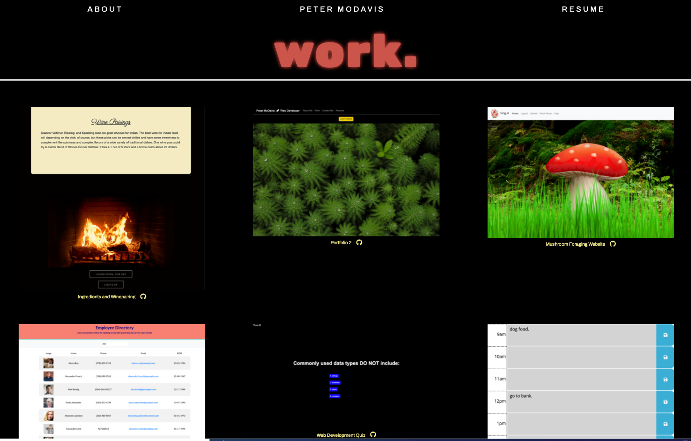
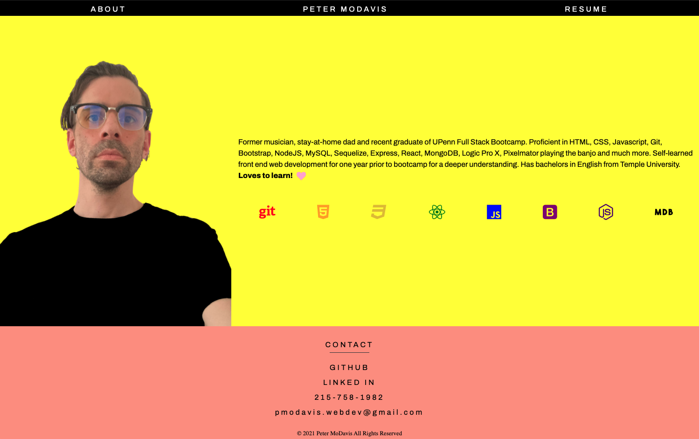

# React Portfolio

## Description

I built this portfolio to showcase my work as a web developer. I used React to make this portfolio and utilized props and react-router to complete the app. While working on this project I learned a lot more about using CSS within a react app and creating multiple components (some that change and some that remain consistant) that combine to make a fluent user experience.

## Usage

All you have to do is go to the deployed portfolio [HERE]()
Once you land on the homepage you are able to click on any of the works to see individually deployed apps or click on their github icons to visit the repos.

 
 
Click on the about page to learn more about me, Peter 😃
 

## Contributing

--[React](https://reactjs.org/) 
--[React-Router](https://reactrouter.com/) 
--[Bootstrap](https://getbootstrap.com/)

## Questions

For any additional questions I can be reached at  [GitHub](https://github.com/PeterMoDavis)  pmodavis.webdev@gmail.com

## License

MIT License

    Copyright (c) [year] [fullname]

    Permission is hereby granted, free of charge, to any person obtaining a copy
    of this software and associated documentation files (the "Software"), to deal
    in the Software without restriction, including without limitation the rights
    to use, copy, modify, merge, publish, distribute, sublicense, and/or sell
    copies of the Software, and to permit persons to whom the Software is
    furnished to do so, subject to the following conditions:

    The above copyright notice and this permission notice shall be included in all
    copies or substantial portions of the Software.

    THE SOFTWARE IS PROVIDED "AS IS", WITHOUT WARRANTY OF ANY KIND, EXPRESS OR
    IMPLIED, INCLUDING BUT NOT LIMITED TO THE WARRANTIES OF MERCHANTABILITY,
    FITNESS FOR A PARTICULAR PURPOSE AND NONINFRINGEMENT. IN NO EVENT SHALL THE
    AUTHORS OR COPYRIGHT HOLDERS BE LIABLE FOR ANY CLAIM, DAMAGES OR OTHER
    LIABILITY, WHETHER IN AN ACTION OF CONTRACT, TORT OR OTHERWISE, ARISING FROM,
    OUT OF OR IN CONNECTION WITH THE SOFTWARE OR THE USE OR OTHER DEALINGS IN THE
    SOFTWARE.

## Badges

